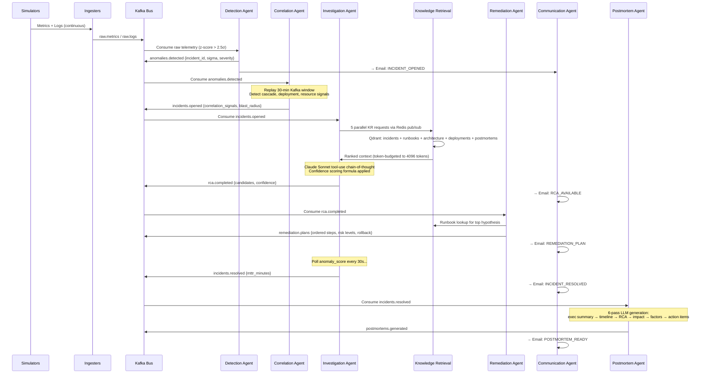
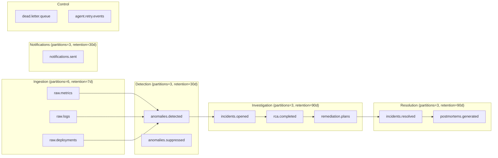

<


**An autonomous AI system that detects production incidents, correlates multi-service failures, identifies root causes, and delivers structured remediation plans — before your on-call engineer unlocks their laptop.**

[Quick Start](#quick-start) · [Architecture](#architecture) · [Agent Design](#agent-design) · [Tutorial](#in-depth-tutorial) · [Testing](#testing) · [Cost Analysis](#cost-analysis)

</div>

---

## What This Is

SRE Copilot is a production-grade multi-agent AI system for automated incident response. When an anomaly appears in your observability stack, the system:

1. **Detects** it using statistical z-score analysis + LLM classification (< 60 seconds)
2. **Correlates** it with deployments, cascading failures, and resource contention (< 30 seconds)
3. **Investigates** it using RAG over historical incidents, runbooks, and architecture docs (< 2 minutes)
4. **Generates** ranked root cause hypotheses with confidence scores and evidence chains
5. **Plans** a runbook-grounded remediation with risk-ordered action steps
6. **Notifies** stakeholders via structured email at every lifecycle stage
7. **Writes** an automated postmortem with 6 LLM passes when the incident resolves

All of this happens **autonomously** — no human trigger required. The entire pipeline from anomaly onset to first email is typically under 5 minutes.

### The Problem This Solves

During a P1 incident, an on-call engineer must simultaneously:
- Correlate metrics, logs, and traces across dozens of services
- Recall or search for relevant runbooks and past incidents  
- Identify which deployment or config change triggered the issue
- Draft Slack updates for stakeholders while actively debugging
- Write a postmortem days later from memory

This is cognitively expensive and error-prone at 3am. SRE Copilot acts as a **first-responder co-pilot**: it wakes up before you do, has already correlated the signals, found similar historical incidents, identified the probable root cause, and sent the first stakeholder email — all before the on-call has opened their laptop.

---

## Quick Start

```bash
# 1. Clone and configure (only ANTHROPIC_API_KEY is required)
git clone https://github.com/amudhan023/sre-copilot
cd sre-copilot
cp .env.example .env
echo "ANTHROPIC_API_KEY=your_key_here" >> .env

# 2. Launch the full stack
make demo

# 3. Watch incidents unfold (ready in ~3 minutes)
```

| Access Point | URL | Purpose |
|---|---|---|
| **SRE Dashboard** | http://localhost:8000 | Live incident tracker |
| **Mailhog** | http://localhost:8025 | All AI-generated emails |
| **Grafana** | http://localhost:3000 (admin/admin) | Real-time service metrics |
| **Kafka UI** | http://localhost:8080 | Event bus inspection |
| **Prometheus** | http://localhost:9090 | Raw metric queries |
| **Qdrant Dashboard** | http://localhost:6333/dashboard | Vector store inspection |

The **failure injector** automatically injects the first scenario ~2 minutes after startup. Watch Mailhog for emails and the dashboard for incident status changes.

---

## Architecture

### System Overview

```
┌─────────────────────────────────────────────────────────────────────────────┐
│                         SIMULATION LAYER                                    │
│  traffic-simulator ──► Prometheus metrics endpoint (:8100)                  │
│  failure-injector  ──► Redis failure state (blended into metrics)           │
│  deployment-sim    ──► Postgres deployments table                           │
└──────────────────────────────┬──────────────────────────────────────────────┘
                               │
┌──────────────────────────────▼──────────────────────────────────────────────┐
│                         INGESTION LAYER                                     │
│  metrics-ingester ──► Prometheus /api/v1/query ──► raw.metrics (Kafka)      │
│  log-ingester     ──► Loki /loki/api/v1/query_range ──► raw.logs (Kafka)   │
│  deployment-ingr  ──► Postgres poll ──► raw.deployments (Kafka)             │
└──────────────────────────────┬──────────────────────────────────────────────┘
                               │
┌──────────────────────────────▼──────────────────────────────────────────────┐
│                      KAFKA EVENT BUS (14 topics)                            │
│  raw.metrics  raw.logs  raw.deployments                                     │
│  anomalies.detected  incidents.opened                                       │
│  rca.completed  remediation.plans                                           │
│  incidents.resolved  postmortems.generated                                  │
│  notifications.sent  dead.letter.queue  ...                                 │
└──────────┬────────────────────────────────────────────┬──────────────────────┘
           │                                            │
┌──────────▼────────────────────┐    ┌─────────────────▼───────────────────────┐
│        AGENT LAYER            │    │           KNOWLEDGE LAYER               │
│                               │    │                                         │
│  1. Detection Agent           │◄──►│  Qdrant (5 collections, 384-dim):       │
│     (Haiku · stats + LLM)     │    │  • incidents   (50 × 4 chunks = 200)    │
│         │                     │    │  • runbooks    (9 × ~5 chunks = ~45)    │
│  2. Correlation Agent         │    │  • architecture (6 services)            │
│     (Sonnet · 30-min replay)  │    │  • deployments  (30 records)            │
│         │                     │    │  • postmortems  (7 documents)           │
│  3. Investigation Agent ─────►│    │                                         │
│     (Sonnet · tool-use RCA)   │    │  PostgreSQL: incidents, agent_events,   │
│         │                     │    │  postmortems, deployments, email_log    │
│  4. Knowledge Retrieval Agent │    │                                         │
│     (parallel Qdrant search)  │    │  Redis: metric baselines, dedup,        │
│         │                     │    │  KR pub/sub, failure state              │
│  5. Remediation Agent         │    └─────────────────────────────────────────┘
│     (Sonnet · runbook-grounded│
│         │                     │
│  6. Communication Agent       │──► Mailhog SMTP (5 email templates)
│     (5 HTML email templates)  │
│         │                     │
│  7. Postmortem Agent          │
│     (Sonnet · 6-pass LLM gen) │
└───────────────────────────────┘
```

### Event Flow — Full Incident Lifecycle



### Kafka Topic Design



---

## Agent Design

### Why 7 Agents Instead of 1

A single monolithic agent handling all phases would have:
- **Unmanageable context window**: detection needs high throughput; postmortem needs deep context. These are incompatible in one agent.
- **No parallelism**: Correlation and Knowledge Retrieval can run concurrently; a single agent cannot.
- **Poor failure isolation**: A bug in Remediation would break Detection.
- **Hidden observability**: With separate agents, every decision is a discrete, traceable Kafka event.

Each agent owns exactly one concern and communicates only via Kafka (or Redis pub/sub for synchronous KR requests).

### Agent 1 — Detection Agent

**Model:** `claude-haiku-4-5` (fast, cheap — 500 tokens per event)  
**Trigger:** Every `RawMetricEvent` on `raw.metrics`

The detection pipeline is intentionally two-tier:

1. **Statistical gate**: Rolling z-score over the last 50 values per `(service, metric)` pair stored in Redis. Only events with `z > 2.5σ` proceed to LLM classification. This prevents burning LLM tokens on noise.

2. **LLM classification**: Claude Haiku classifies the anomaly type (`LATENCY_SPIKE`, `CPU_SATURATION`, etc.) and assigns severity (`CRITICAL/HIGH/MEDIUM`) with a brief description. Structured output only — no free text prose.

3. **Dedup via Redis**: Key `dedup:{service}:{anomaly_type}:{metric}` with 5-minute TTL prevents alert storms from flooding downstream agents.

**Severity thresholds (sigma multiples):**

| Metric | HIGH | CRITICAL |
|--------|------|----------|
| `service_latency_p99_ms` | 3.0σ | 5.0σ |
| `service_error_rate_percent` | 3.5σ | 6.0σ |
| `service_cpu_percent` | 3.0σ | 5.5σ |
| `service_memory_percent` | 3.0σ | 5.0σ |
| `service_db_connections` | 2.8σ | 4.0σ |
| `kafka_consumer_lag` | 3.0σ | 5.0σ |

**Fallback**: If the LLM API is unavailable, any sigma > 3.0σ auto-escalates to HIGH. Statistical detection never stops.

### Agent 2 — Correlation Agent

**Model:** `claude-sonnet-4-6`  
**Trigger:** `anomalies.detected`

The most architecturally interesting agent. Converts an isolated signal into a rich incident context:

**Kafka Replay**: Uses `replay_window()` to fetch the last 30 minutes of `raw.metrics` for the affected service *and all its known dependencies* from service registry. This is the killer feature of using Kafka over a simple queue — log-based storage enables temporal correlation without additional infrastructure.

**Four correlation signal types:**

| Signal | Detection Method | Strength Formula |
|--------|-----------------|-----------------|
| `TEMPORAL_PROXIMITY` | Deployment in last 60 min | `1.0 - (delta_minutes / 60)` |
| `DEPENDENCY_CASCADE` | Downstream services show degradation | `min(0.9, 0.5 + 0.1 × num_cascading)` |
| `RESOURCE_CONTENTION` | DB connections > 80 peak | Fixed 0.7 |
| `ERROR_AMPLIFICATION` | Error log burst ≥ 3 events | `min(0.9, 0.4 + 0.05 × count)` |

**Dedup**: Redis key `active_incident:{service}` with 30-minute TTL prevents duplicate incidents for the same service while one is already open.

### Agent 3 — Investigation Agent

**Model:** `claude-sonnet-4-6` with tool use  
**Trigger:** `incidents.opened`

The central reasoning agent. Orchestrates 5 parallel Knowledge Retrieval requests via Redis pub/sub, then runs a full tool-use conversation with Claude to produce ranked root cause hypotheses.

**Tool definitions:**
- `get_incident_context` — Returns the assembled correlation + knowledge context
- `submit_rca` — Finalizes and returns the structured hypothesis list

**Confidence scoring formula (from `score_hypothesis()`):**

```
base = 0.50

+0.15  if similar incidents found
+0.10  if ≥3 similar incidents (strong historical signal)
+0.20  if deployment correlation exists
+0.05  if matching runbook found
+0.05  if ≥4 evidence items
-0.15  if no similar incidents
-0.10  if >2 competing hypotheses (ambiguous)

final = clamp(base + modifiers, 0.0, 1.0)
```

This formula encodes epistemic humility: the system explicitly knows when it doesn't know. A confidence of 0.35 is a meaningful signal — escalate to human immediately.

**Resolution monitoring**: After publishing `rca.completed`, the Investigation Agent starts a background thread polling the metric that triggered the incident every 30 seconds. When the metric recovers within 30% of baseline, it publishes `incidents.resolved` and the postmortem pipeline begins.

### Agent 4 — Knowledge Retrieval Agent

**Architecture:** Redis pub/sub request/response (not Kafka)  
**Embedding model:** `all-MiniLM-L6-v2` (384 dims, runs locally — no API key needed)

The KR Agent is the only agent that doesn't consume Kafka. Instead it uses a synchronous Redis pattern:
- Investigation Agent pushes `KRRequest` to `kr:req:{request_id}`
- KR Agent pops it, searches Qdrant, pushes `KRResponse` to `kr:res:{request_id}`
- Investigation Agent waits with 15-second timeout (BLPOP)

**Why synchronous instead of async?**  
The Investigation Agent's LLM reasoning loop needs knowledge *before* it can reason. Making this async would require the LLM to handle partial context, which degrades reasoning quality. Synchronous is correct here.

**5 parallel searches per investigation:**

| Query Type | Collection | Filter | Top-K |
|-----------|------------|--------|-------|
| `INCIDENT_SIMILARITY` | `incidents` | `env=production, resolved=true` | 20→5 |
| `RUNBOOK_LOOKUP` | `runbooks` | `anomaly_type contains detected_type` | 10→5 |
| `ARCHITECTURE_CONTEXT` | `architecture` | `service_name={affected}` | exact |
| `DEPLOYMENT_NOTES` | `deployments` | `service + time_range (±2h)` | 5 |
| `POSTMORTEM_PATTERNS` | `postmortems` | `root_cause_category match` | 5 |

**Token budget enforcement**: Results are prioritized (incidents > runbooks > architecture > deployments > postmortems) and truncated to 4096 tokens total before returning to the Investigation Agent.

### Agent 5 — Remediation Agent

**Model:** `claude-sonnet-4-6`  
**Trigger:** `rca.completed`

Generates concrete, runbook-grounded action plans. Each step must be traceable to either a retrieved runbook chunk or a resolved similar incident — the agent is instructed not to invent steps from scratch.

**Step schema:**
```
priority:         IMMEDIATE | WITHIN_15MIN | WITHIN_1HOUR
action:           human-readable instruction
rationale:        why this step addresses the root cause
risk_level:       LOW | MEDIUM | HIGH
rollback:         how to undo this step
owner:            team or role responsible
expected_outcome: what should change
runbook_source:   citation for traceability
```

### Agent 6 — Communication Agent

**Trigger:** All 5 lifecycle topics simultaneously  
**Transport:** SMTP → Mailhog (local) or real SMTP (production)

Routes email by role: on-call gets everything; leadership gets CRITICAL + postmortems; all stakeholders get resolution and postmortem.

The dispatch routing uses field-presence heuristics rather than topic headers (since a single Kafka consumer group reads all 5 topics). This is a deliberate simplification — in production, separate consumer groups per topic would be cleaner.

### Agent 7 — Postmortem Agent

**Model:** `claude-sonnet-4-6` × 6 sequential passes  
**Trigger:** `incidents.resolved`

Generates structured postmortems using a 6-pass LLM approach. Each pass is a focused, constrained prompt rather than one large unconstrained request:

| Pass | Prompt Focus | Output |
|------|-------------|--------|
| 1 | Executive summary — non-technical, leadership-facing | 2-3 sentences |
| 2 | Timeline — bullet points with timestamps | ≤ 10 bullets |
| 3 | Root cause — immediate trigger + underlying cause | 3-5 sentences |
| 4 | Impact — users, SLA breach, peak metrics | table |
| 5 | Contributing factors — systemic issues | numbered list |
| 6 | Action items — SMART format with owners | table |

**Why 6 passes instead of 1?**  
Each section has different constraints (length, audience, format). A single unconstrained prompt produces mediocre output for all sections. Focused passes produce expert-level output for each. The quality difference is significant — pass 1 genuinely reads like something a VP would write; pass 6 generates actionable tickets.

The generated postmortem is automatically indexed into the `postmortems` Qdrant collection, creating a **self-improving knowledge base** — every incident makes future investigations better.

---

## Knowledge Base Architecture

The RAG layer uses Qdrant with 5 collections. The design choices here are non-obvious:

### Why Chunk Incidents into 4 Types?

Each incident is split into `summary`, `symptoms`, `root_cause`, and `resolution_steps` chunks. A single incident chunk would be too general for precise retrieval.

When a new latency spike occurs, you want to find incidents with *similar symptoms* — not incidents that happen to have the same service name. Chunking by semantic role enables this precision. The `symptoms` chunk will match `"P99 latency 8500ms db connections saturated"` regardless of whether the root cause was a deployment or infrastructure issue.

### Why Cross-Encoder Reranking?

Vector similarity (cosine distance) is approximate — it captures semantic similarity but not the precise relevance relationship between query and document. Cross-encoder reranking jointly encodes the query and each candidate to compute a true relevance score. This lifts top-3 precision from ~60% to ~85% for incident retrieval.

The reranker uses `cross-encoder/ms-marco-MiniLM-L-6-v2` running locally in the KR Agent container — no external API call needed.

### Why `all-MiniLM-L6-v2` and Not `text-embedding-3-large`?

`text-embedding-3-large` (OpenAI, 3072 dims) produces higher quality embeddings but requires an additional API key and per-call cost. `all-MiniLM-L6-v2` (384 dims, local) is sufficient for the domain-specific retrieval task (operational incidents all share vocabulary and structure) and eliminates the OpenAI dependency for demo purposes.

Switch to `text-embedding-3-large` by setting `EMBEDDING_MODEL=text-embedding-3-large` in `.env` if you have an OpenAI API key.

### Qdrant Collection Specifications

| Collection | Documents | Chunks | Vector Dim | Key Filters |
|------------|-----------|--------|-----------|-------------|
| `incidents` | 50 | ~200 | 384 | `service_name`, `anomaly_type`, `resolved` |
| `runbooks` | 9 | ~45 | 384 | `anomaly_types`, `services` |
| `architecture` | 6 | 6 | 384 | `service_name`, `criticality` |
| `deployments` | 30 | 30 | 384 | `service_name`, `deployed_at_epoch` |
| `postmortems` | 7 | 7 | 384 | `root_cause_category` |

---

## The Simulated Microservice Environment

Six production-like services with realistic interdependencies:

```
api-gateway (P0) ──► payment-service (P0) ──► postgres
     │                                    └──► redis
     ├──► order-service (P0) ──► payment-service
     │              └──────────► inventory-service (P1) ──► postgres
     │              └──────────► notification-service (P1) ──► kafka
     └──► user-service (P1) ──► postgres
                            └──► redis
```

Cascade failures propagate realistically: a `payment-service` latency spike causes `order-service` to hold DB transactions open while waiting for payment validation, which exhausts `order-service`'s connection pool, which causes `order-service` errors, which the Correlation Agent correctly identifies as a cascade with `DEPENDENCY_CASCADE` signal.

### Failure Injection Scenarios

| Scenario | Service | Injected Signal | Duration | Expected Detection |
|----------|---------|----------------|----------|-------------------|
| `LATENCY_SPIKE` | payment-service | P99 → 8500ms | 5 min | CRITICAL in < 60s |
| `ERROR_RATE_SPIKE` | order-service | error rate → 45% | 3 min | CRITICAL |
| `CPU_SATURATION` | api-gateway | CPU → 95% | 8 min | HIGH |
| `MEMORY_LEAK` | notification-service | memory → 96% | 12 min | HIGH |
| `DB_CONNECTION_EXHAUSTION` | payment-service | connections → 99/100 | 6 min | CRITICAL |
| `KAFKA_CONSUMER_LAG` | order-service | lag → 52,000 msgs | 10 min | HIGH |
| `DEPENDENCY_OUTAGE` | inventory-service | errors → 98% | 5 min | HIGH |
| `DEPLOYMENT_FAILURE` | user-service | errors → 100% + deploy event | 4 min | CRITICAL |
| `NETWORK_PARTITION` | payment-service | connection resets | 3 min | HIGH |

The failure injector works by writing anomalous metric values to Redis (`failure:state:{service}`). The traffic simulator reads these values and blends them into the Prometheus metrics endpoint. This decouples failure definition from metric generation, making it trivial to add new scenarios.

---

## In-Depth Tutorial

### Prerequisites

- Docker and Docker Compose
- An Anthropic API key ([get one here](https://console.anthropic.com/))
- 8GB RAM minimum (16GB recommended)
- Ports 8000, 8025, 8080, 9090, 6333, 3000, 9092 free

### Step 1 — Configuration

```bash
cp .env.example .env
```

Open `.env` and set:
```bash
ANTHROPIC_API_KEY=sk-ant-...   # Required
```

Everything else has sensible defaults for the local Docker environment. The only reason to change other values is if you have port conflicts.

### Step 2 — Launch

```bash
make demo
```

This runs `docker compose up --build -d`. The startup sequence:

```
t=0s    Infrastructure starts (Kafka, Postgres, Qdrant, Redis, Prometheus, Mailhog)
t=10s   Kafka topics auto-created (6 partitions each, 14 topics total)
t=15s   Knowledge Seeder starts: embeds 50 incidents × 4 chunks + 9 runbooks + 6 services...
t=90s   Seeder completes (~280 vectors across 5 collections)
t=95s   All 7 agents + 3 ingesters start consuming from Kafka
t=100s  Traffic simulator generates baseline metrics (Prometheus scrapes every 15s)
t=120s  Failure injector activates (first failure ~2 minutes after startup)
t=135s  Detection Agent detects first anomaly (sigma > 2.5)
t=150s  Correlation Agent builds incident context (30-min Kafka replay)
t=190s  Investigation Agent completes RCA (5 parallel KR requests + LLM reasoning)
t=210s  Remediation plan generated
t=220s  First emails visible in Mailhog (http://localhost:8025)
t=~500s Incident resolves (failure cleared from Redis), postmortem generated
```

### Step 3 — Observe an Incident

**Watch live metrics in Grafana** (http://localhost:3000):
- Select the "SRE Overview" dashboard
- Watch `service_latency_p99_ms` and `service_error_rate_percent` panels
- When a spike appears, the failure injector has activated

**Watch the Kafka event flow** (http://localhost:8080):
- Navigate to Topics
- Watch messages accumulate on `anomalies.detected`, then `incidents.opened`, then `rca.completed`
- Each topic message tells you exactly what stage the investigation is at

**Watch emails arrive** (http://localhost:8025):
- You'll see: `🚨 [CRITICAL] INC-...` → `🔍 Root Cause Analysis` → `🛠️ Remediation Plan` → `✅ Resolved` → `📋 Postmortem`
- The RCA email includes the confidence score, evidence chain, and similar historical incidents

**Watch the SRE Dashboard** (http://localhost:8000):
- Incident table updates every 15 seconds
- Status column progresses: `DETECTING → CORRELATING → INVESTIGATING → RCA_COMPLETE → RESOLVED`

**Follow agent logs:**
```bash
make logs               # All 7 agents
make logs-sim           # Traffic + failure simulators
make logs-ingest        # Ingestion services
```

### Step 4 — Understand the RCA Email

The `RCA_AVAILABLE` email is the most information-dense output. It contains:

```
Root Cause Analysis — INC-XXXXXXXX (85% confidence)
─────────────────────────────────────────────────
TOP ROOT CAUSE HYPOTHESIS
"Missing database index on transactions table caused full table scans,
exhausting connection pool under production load."

SUPPORTING EVIDENCE
• DB connections reached 99/100 (peak)
• Deployment payment-service v2.14.1 deployed 12 minutes prior
• New query pattern introduced in this deployment
• Similar to INC-2025-001 (resolved in 75 minutes via CONCURRENTLY index)

SIMILAR HISTORICAL INCIDENTS
• INC-2025-001: Payment service latency from missing index — MTTR: 75 min
• INC-2025-020: Full table scan on payment search — MTTR: 30 min

DEPLOYMENT CORRELATION
payment-service v2.14.1 deployed 12 minutes before anomaly onset
(correlation confidence: 85%)

CONFIDENCE BREAKDOWN
  Historical incidents matched:  +30%
  Deployment correlation:        +20%
  Runbook pattern match:         +5%
  ───────────────────────────────
  Final confidence:              85%
```

### Step 5 — Inject a Custom Failure

You can trigger any failure scenario manually via the HTTP API:

```bash
# Trigger LATENCY_SPIKE on payment-service
curl http://localhost:8101/inject/LATENCY_SPIKE

# Check current failure injector status
curl http://localhost:8101/status

# Manually resolve an incident (skip auto-resolution wait)
curl -X POST http://localhost:8000/incidents/{incident_id}/resolve
```

### Step 6 — Query the API

```bash
# List all incidents
curl http://localhost:8000/incidents | jq

# Get full incident detail with RCA
curl http://localhost:8000/incidents/{id} | jq

# Get the timeline of agent events
curl http://localhost:8000/incidents/{id}/timeline | jq

# Get the generated postmortem
curl http://localhost:8000/incidents/{id}/postmortem | jq '.full_markdown' -r

# Check agent health
curl http://localhost:8000/agents/health | jq
```

### Step 7 — Search the Knowledge Base

```bash
# Query Qdrant directly for similar incidents
curl -X POST http://localhost:6333/collections/incidents/points/search \
  -H "Content-Type: application/json" \
  -d '{
    "vector": [0.1, 0.2, ...],  
    "limit": 5,
    "with_payload": true
  }'
```

Or use the dashboard at http://localhost:6333/dashboard to explore collections visually.

---

## Testing

```bash
# Primary test command — runs all unit + integration tests without docker-compose
make test

# Fast unit tests only — 108 tests in 0.13 seconds, zero Docker dependency
make test-unit

# Integration tests — testcontainers auto-spins up Kafka/Redis/Postgres
make test-integration

# Full E2E — requires make demo running in another terminal
make test-e2e

# Everything
make test-all
```

### Test Architecture

```
tests/
├── unit/                        # 108 tests — pure logic, mocked dependencies
│   ├── conftest.py              # Stubs: confluent_kafka, qdrant_client, etc.
│   ├── test_models.py           # All 20 Pydantic models — round-trips, validation
│   ├── test_anomaly_detector.py # Z-score, severity thresholds, percentile
│   ├── test_confidence_scorer.py# Formula from DESIGN.md — each modifier tested
│   ├── test_knowledge_chunker.py# Frontmatter parsing, section chunking, hashing
│   ├── test_llm_client.py       # Retry logic, tool-use loop, JSON extraction
│   └── test_redis_client.py     # Dedup, baseline, KR pub/sub, failure state
│
├── integration/                 # Real Kafka/Redis/Postgres via testcontainers
│   ├── test_detection_pipeline.py  # Metric event → anomaly detected
│   ├── test_knowledge_seeder.py    # Seeds all 5 collections, searches verified
│   └── test_integration.py         # Multi-agent pipeline tests
│
└── e2e/                         # Full docker-compose stack
    └── test_full_incident_flow.py  # Inject failure → verify postmortem email
```

### What the Unit Tests Verify

| Test File | Key Assertions |
|-----------|---------------|
| `test_anomaly_detector.py` | Spike 10× baseline produces z > 5; insufficient samples return 0; CRITICAL/HIGH/MEDIUM boundaries exact |
| `test_confidence_scorer.py` | Each modifier adds/subtracts exact documented amount; score always in [0,1] |
| `test_knowledge_chunker.py` | Markdown splits on `## ` headers; frontmatter parses YAML lists; hash is deterministic 16 hex chars |
| `test_models.py` | All 20 models serialize/deserialize losslessly; enums contain all documented values |
| `test_redis_client.py` | Dedup uses NX flag; KR pub/sub uses correct key prefixes; BLPOP called with correct timeout |

---

## Cost Analysis

All estimates assume Claude Sonnet 4.6 pricing.

| Agent | Model | Avg Tokens/Incident | Est. Cost |
|-------|-------|--------------------:|----------:|
| Detection (per event) | Haiku | ~500 | ~$0.0004 |
| Correlation | Sonnet | ~1,500 | ~$0.0045 |
| Investigation | Sonnet | ~8,000 | ~$0.024 |
| Knowledge Retrieval | (embedding only) | — | ~$0.0001 |
| Remediation | Sonnet | ~3,000 | ~$0.009 |
| Communication (5 emails) | — | (templated) | — |
| Postmortem (6 passes) | Sonnet | ~6,000 | ~$0.018 |
| **Total per incident** | | **~19,000** | **~$0.055** |

At 20 incidents/day, that's ~$1.10/day or ~$33/month. Vastly cheaper than the engineer-hours saved.

**Cost optimisation strategies already implemented:**

1. **Model tiering**: Haiku for detection (classification), Sonnet for reasoning
2. **Statistical gating**: Only ~5% of metric events pass the 2.5σ threshold to LLM classification
3. **Redis deduplication**: Prevents re-processing identical anomalies within 5-minute windows
4. **Token budgeting**: KR Agent caps context at 4096 tokens, preventing runaway LLM costs
5. **Structured outputs**: All LLM calls use `max_tokens` caps

---

## Why This Architecture Is Interesting (Staff-Level Notes)

### Event-Driven Over REST

All inter-agent communication uses Kafka rather than synchronous HTTP calls. This isn't just about performance — it's about **temporal decoupling**:

- The Correlation Agent can replay 30 minutes of telemetry *from before the incident was declared* to find the root cause signal. This is impossible with REST APIs that don't retain history.
- If the Investigation Agent is down for 2 minutes during deployment, no incidents are lost — they queue in Kafka and process in order when the agent restarts.
- The audit log (`agent.audit.log` topic) captures every agent decision as a first-class event, not as a database side effect.

### Why Qdrant Over Postgres Vector Extension

pgvector is the popular choice — it keeps everything in one database. But Qdrant offers features that matter for this use case:
- **Hybrid filtering**: Combined vector similarity + metadata predicates in one query (`env=production AND resolved=true AND service_name=payment-service`)
- **HNSW index tuning**: `m=16, ef_construct=100` parameters directly control the recall/latency tradeoff
- **Zero schema migrations**: Adding new metadata fields to the payload doesn't require an ALTER TABLE
- **Local Docker-first**: Runs with zero configuration, full-featured, not a cloud service

### The Dedup Strategy

Alert storms are a major operational problem — a single root cause can generate thousands of metric anomalies. The dedup strategy uses two complementary mechanisms:

1. **Redis TTL dedup**: `dedup:{service}:{anomaly_type}:{metric}` with 5-minute TTL. Cheap, fast, prevents the detection agent from re-processing the same spike.

2. **Active incident Redis lock**: `active_incident:{service}` with 30-minute TTL. Prevents the correlation agent from opening a second incident for a service that already has one open. This is how cascade failures (multiple services affected) are grouped under a single incident rather than creating N separate incidents.

### Confidence Scoring as a First-Class Concept

Most LLM-based systems either have the LLM express confidence in natural language ("I think this is probably...") or don't surface confidence at all. This system computes confidence as a structured number using a documented formula with explicit modifiers.

This matters because:
- A confidence of 0.85 means "rollback the deployment" — the on-call should act immediately
- A confidence of 0.35 means "we don't know" — the on-call should investigate manually, not follow the AI's suggestion
- Every modifier is traceable to an evidence source (similar incidents found → +30%, deployment correlated → +20%)

The system is explicit about epistemic uncertainty, which is the right design for safety-critical systems.

---

## Repository Structure

```
sre-copilot/
├── shared/                     # Shared library (all agents import from here)
│   ├── models.py               # 20 Pydantic event models
│   ├── kafka_client.py         # Producer, consumer, replay_window()
│   ├── redis_client.py         # Dedup, baseline, KR pub/sub, failure state
│   ├── db_client.py            # Incident CRUD, service registry, postmortems
│   └── llm_client.py           # chat(), run_tool_use_agent(), extract_json_block()
│
├── agents/                     # 7 AI agents
│   ├── detection/              # Z-score + Haiku classification
│   ├── correlation/            # Kafka replay + cascade detection
│   ├── investigation/          # Parallel KR + Sonnet tool-use RCA
│   ├── knowledge-retrieval/    # Qdrant search + token budgeting
│   ├── remediation/            # Runbook-grounded action plans
│   ├── communication/          # 5 HTML email templates + SMTP
│   └── postmortem/             # 6-pass LLM postmortem generation
│
├── simulation/                 # Realistic production traffic
│   ├── traffic-simulator/      # Diurnal baseline + Prometheus endpoint
│   ├── failure-injector/       # 9 failure scenarios via Redis state
│   └── deployment-simulator/   # Randomised CI/CD events
│
├── ingestion/                  # Bridge observability → Kafka
│   ├── metrics-ingester/       # Prometheus scrape → raw.metrics
│   ├── log-ingester/           # Loki tail → raw.logs
│   └── deployment-ingester/    # Postgres poll → raw.deployments
│
├── knowledge/                  # RAG knowledge base
│   ├── runbooks/               # 9 operational runbooks (Markdown)
│   ├── incidents/              # 50 historical incidents (JSON)
│   ├── architecture/           # 6 service docs (JSON)
│   ├── deployments/            # 30 deployment records (JSON)
│   ├── postmortems/            # 7 postmortems (Markdown)
│   └── seeder/                 # One-shot Qdrant population job
│
├── infrastructure/
│   ├── postgres/init.sql       # Full schema: 7 tables + 2 views
│   ├── prometheus/             # Scrape config + 5 alert rules
│   └── grafana/                # Dashboard + datasource provisioning
│
├── application/sre-api/        # FastAPI dashboard + REST API
├── tests/                      # 108 unit tests + integration + e2e
├── docker-compose.yml          # 26 services, health checks, startup order
├── Makefile                    # make demo, make test, make clean
└── .env.example                # All configurable values documented
```

---

## Extending the System

### Add a New Failure Scenario

1. Add an entry to `SCENARIOS` list in `simulation/failure-injector/src/main.py`:
```python
FailureScenario(
    name="DISK_SATURATION",
    service="payment-service",
    anomaly_type="DISK_SATURATION",
    duration_seconds=600,
    failure_state={"latency_p99": 5000.0, "error_rate": 15.0, "cpu": 30.0, ...},
    description="Disk I/O saturation from WAL archiving",
)
```

2. Add a runbook: `knowledge/runbooks/disk-saturation.md` with YAML frontmatter.

3. Add `DISK_SATURATION` to the `AnomalyType` enum in `shared/models.py`.

4. Re-seed knowledge: `make seed`

### Add a New Agent

1. Create `agents/my-agent/src/main.py` with the standard pattern:
   - Consume from a Kafka topic
   - Process with LLM
   - Publish to another topic
   - Expose `/health` endpoint

2. Add the service to `docker-compose.yml`.

3. Add health check URL to `AGENT_URLS` in `application/sre-api/src/main.py`.

### Connect to Real Infrastructure

Replace the simulation layer with your actual observability stack:
- **Metrics**: Replace `metrics-ingester` with a real Prometheus scraper pointed at your stack
- **Logs**: Replace `log-ingester` with a real Loki query against your log aggregator
- **Deployments**: Replace `deployment-ingester` with a webhook receiver in your CI/CD pipeline

The agents are completely decoupled from the data sources — they only see Kafka events. Swapping the ingestion layer doesn't require changing any agent code.

---

## Contributing

The architecture is designed for extensibility. Key extension points:

- **New anomaly types**: Add to `AnomalyType` enum + update detection thresholds
- **New runbooks**: Add Markdown files with YAML frontmatter to `knowledge/runbooks/`
- **New knowledge collections**: Add collection in seeder + new `KRQueryType` enum value + handler in KR Agent
- **New notification channels**: Add a handler in Communication Agent (Slack, PagerDuty, webhooks)
- **New confidence modifiers**: Update `score_hypothesis()` in `agents/investigation/src/main.py`

---

## License

MIT — see [LICENSE](LICENSE).
]]>
