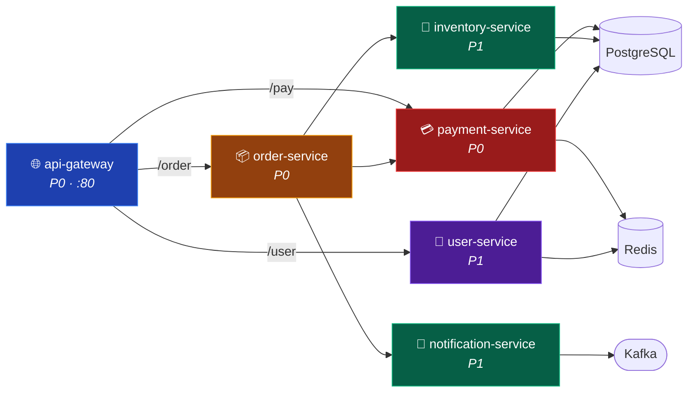
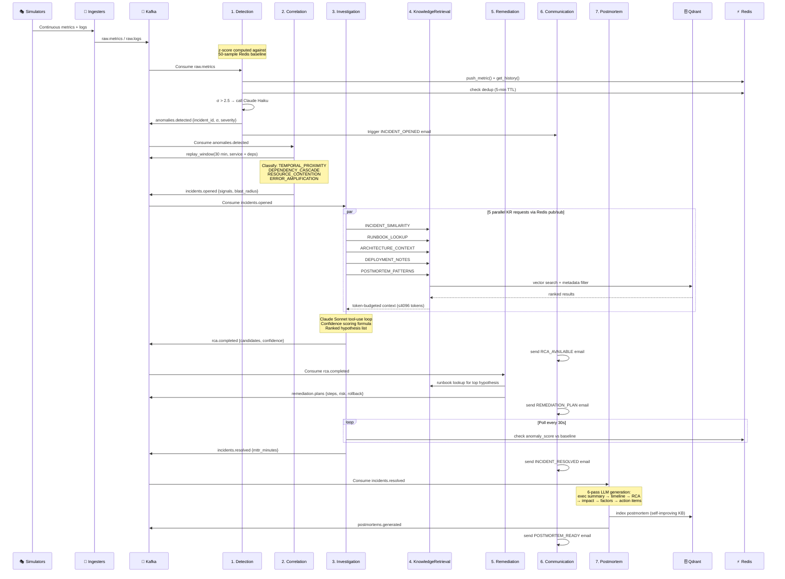
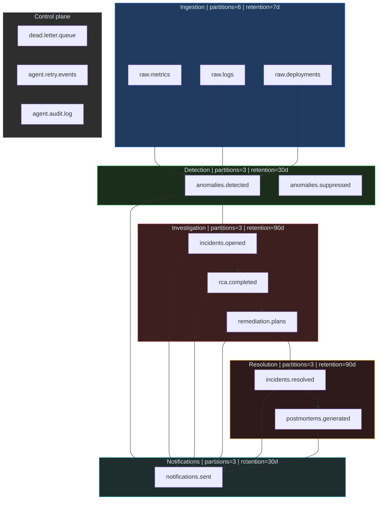
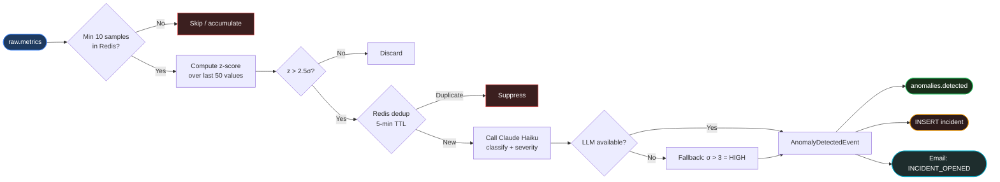
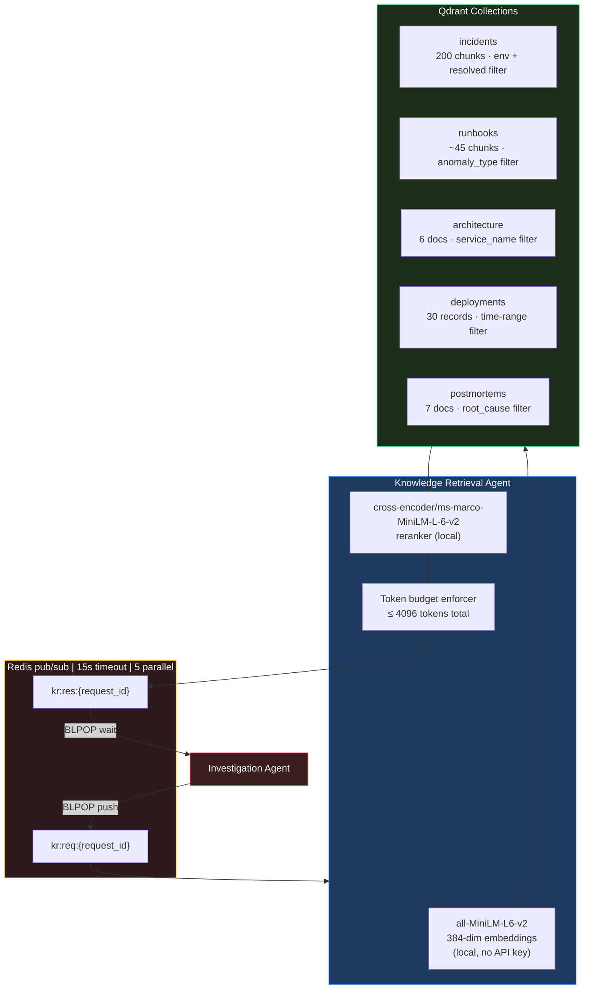
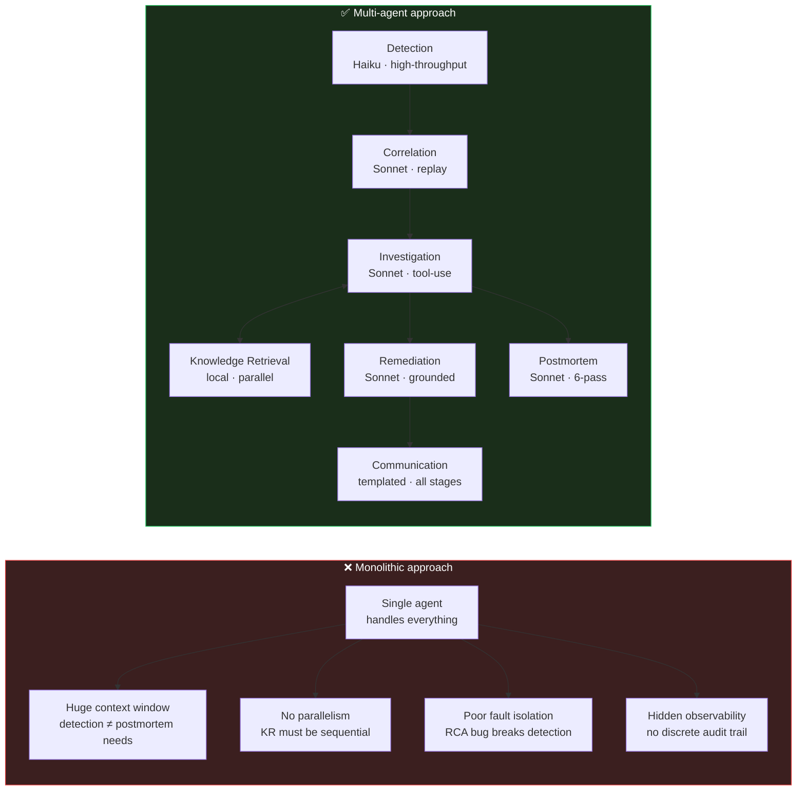

<div align="center">


<br/>
<br/>

[](https://python.org)
[](https://anthropic.com)
[](https://kafka.apache.org)
[](https://qdrant.tech)
[](https://docker.com)
[](tests/)

<h3>An autonomous multi-agent AI system for production incident response.</h3>
<p>Detects anomalies, correlates failures, identifies root causes, and delivers remediation plans — before your on-call engineer unlocks their laptop.</p>

**[Quick Start](#-quick-start)** · **[High-Level Architecture](#-high-level-architecture)** · **[Low-Level Architecture](#-low-level-architecture)** · **[Agent Design](#-agent-design)** · **[Operations](#-operational-guide)** · **[Testing](#-testing)**

</div>

---

## The Problem

During a P1 incident, an on-call engineer must simultaneously correlate metrics, logs, and traces across dozens of services, recall runbooks, identify the triggering change, draft stakeholder updates, and write a postmortem days later from memory. This is cognitively expensive and error-prone at 3am.

**SRE Copilot is the first responder.** It wakes up before you do, correlates the signals, finds similar historical incidents, identifies the probable root cause, and sends the first stakeholder email — all in under 5 minutes.

| Without SRE Copilot | With SRE Copilot |
|---|---|
| Manual metric correlation across dashboards | Automated anomaly detection in < 60 seconds |
| "Which deployment caused this?" | Deployment correlation with confidence score |
| Searching runbooks while debugging | Ranked runbook retrieval via RAG |
| Stakeholder updates written mid-incident | Structured emails sent automatically at each stage |
| Postmortem written from memory days later | 6-pass LLM postmortem generated automatically |

---

## ⚡ Quick Start

### Prerequisites

- Docker & Docker Compose
- An [Anthropic API key](https://console.anthropic.com/)
- 8 GB RAM minimum (16 GB recommended)
- Ports `8000, 8025, 8080, 9090, 6333, 3000, 9092` free

### Three-command setup

```bash
# 1. Clone and configure
git clone https://github.com/amudhan023/sre-copilot && cd sre-copilot
cp .env.example .env
# Edit .env and set ANTHROPIC_API_KEY=sk-ant-...

# 2. Launch the full stack (26 services)
make demo

# 3. Watch incidents unfold (~3 minutes to fully initialize)
```

### Access points

| Service | URL | Purpose |
|---|---|---|
| **SRE Dashboard** | http://localhost:8000 | Live incident tracker & REST API |
| **Mailhog** | http://localhost:8025 | All AI-generated email notifications |
| **Grafana** | http://localhost:3000 `admin/admin` | Real-time service metrics |
| **Kafka UI** | http://localhost:8080 | Event bus topic inspection |
| **Prometheus** | http://localhost:9090 | Raw metric queries |
| **Qdrant** | http://localhost:6333/dashboard | Vector store exploration |

The failure injector activates **~2 minutes after startup**. Watch Mailhog for emails and the dashboard for incident status changes.

### Startup timeline

```
t=0s    Infrastructure: Kafka, Postgres, Qdrant, Redis, Prometheus, Mailhog
t=15s   Knowledge Seeder: embeds 50 incidents + 9 runbooks + 6 service docs (~280 vectors)
t=95s   All 7 agents + 3 ingesters start consuming from Kafka
t=120s  Failure injector activates (first scenario triggers ~2 min after start)
t=135s  Detection Agent fires (z-score > 2.5σ)
t=160s  Correlation Agent correlates signals (30-min Kafka replay)
t=190s  Investigation Agent completes RCA (5 parallel RAG queries + LLM reasoning)
t=210s  Remediation plan generated
t=220s  First emails visible in Mailhog
t=~500s Incident resolves → automated postmortem generated
```

---

## 🏗 High-Level Architecture

The system is organized into five distinct layers. Each layer has a single responsibility and communicates only via the Kafka event bus (or Redis for synchronous sub-requests).

```mermaid
graph TB
    subgraph SIM["🎭 Simulation Layer"]
        direction LR
        TS["Traffic Simulator<br/>(diurnal baseline + failures)"]
        FI["Failure Injector<br/>(9 failure scenarios)"]
        DS["Deployment Simulator<br/>(CI/CD events)"]
    end

    subgraph OBS["📡 Observability Sources"]
        direction LR
        PROM["Prometheus<br/>:9090"]
        LOKI["Loki<br/>:3100"]
        PG1["PostgreSQL<br/>(deployments)"]
    end

    subgraph INGEST["🔄 Ingestion Layer"]
        direction LR
        MI["Metrics Ingester<br/>scrape every 15s"]
        LI["Log Ingester<br/>poll every 5s"]
        DI["Deployment Ingester<br/>poll every 10s"]
    end

    subgraph BUS["🚌 Kafka Event Bus (14 topics)"]
        direction LR
        T1["raw.metrics"]
        T2["raw.logs"]
        T3["raw.deployments"]
        T4["anomalies.detected"]
        T5["incidents.opened"]
        T6["rca.completed"]
        T7["remediation.plans"]
        T8["incidents.resolved"]
        T9["postmortems.generated"]
    end

    subgraph AGENTS["🤖 Agent Layer"]
        A1["1. Detection Agent<br/>Haiku · z-score + LLM"]
        A2["2. Correlation Agent<br/>Sonnet · Kafka replay"]
        A3["3. Investigation Agent<br/>Sonnet · tool-use RCA"]
        A4["4. Knowledge Retrieval<br/>local embeddings · Qdrant"]
        A5["5. Remediation Agent<br/>Sonnet · runbook-grounded"]
        A6["6. Communication Agent<br/>HTML email templates"]
        A7["7. Postmortem Agent<br/>Sonnet · 6-pass generation"]
    end

    subgraph KNOW["🧠 Knowledge Layer"]
        QD["Qdrant Vector DB<br/>5 collections · 384-dim"]
        PG2["PostgreSQL<br/>incidents · postmortems · logs"]
        RD["Redis<br/>baselines · dedup · pub/sub"]
    end

    subgraph OUT["📬 Outputs"]
        MAIL["Mailhog / SMTP<br/>5 email templates"]
        API["SRE Dashboard API<br/>FastAPI :8000"]
    end

    SIM --> OBS
    OBS --> INGEST
    INGEST --> BUS
    BUS --> AGENTS
    AGENTS <--> KNOW
    AGENTS --> OUT

    style SIM fill:#1e3a5f,stroke:#3b82f6,color:#e2e8f0
    style OBS fill:#1a1a2e,stroke:#6366f1,color:#e2e8f0
    style INGEST fill:#1e3a5f,stroke:#8b5cf6,color:#e2e8f0
    style BUS fill:#1a2e1a,stroke:#22c55e,color:#e2e8f0
    style AGENTS fill:#3b1f1f,stroke:#ef4444,color:#e2e8f0
    style KNOW fill:#2d1b1b,stroke:#f59e0b,color:#e2e8f0
    style OUT fill:#1e2d2d,stroke:#06b6d4,color:#e2e8f0
```



### Simulated microservice environment

Six production-like services with realistic interdependencies form the target system:



---

## 🔬 Low-Level Architecture

### Full incident lifecycle — event sequence



### Kafka topic topology



### Detection pipeline — z-score flow



### Severity thresholds (sigma multiples)

| Metric | HIGH threshold | CRITICAL threshold |
|--------|:--------------:|:------------------:|
| `service_latency_p99_ms` | 3.0σ | 5.0σ |
| `service_error_rate_percent` | 3.5σ | 6.0σ |
| `service_cpu_percent` | 3.0σ | 5.5σ |
| `service_memory_percent` | 3.0σ | 5.0σ |
| `service_db_connections` | 2.8σ | 4.0σ |
| `kafka_consumer_lag` | 3.0σ | 5.0σ |

### Confidence scoring formula

The Investigation Agent computes a structured confidence score — not a vague LLM probability:

```
base = 0.50

Positive modifiers:
  +0.15  similar incidents found in knowledge base
  +0.10  ≥ 3 similar incidents (strong historical signal)
  +0.20  deployment correlation detected within 60 minutes
  +0.05  matching runbook found
  +0.05  ≥ 4 evidence items supporting hypothesis

Negative modifiers:
  −0.15  no similar incidents found
  −0.10  > 2 competing hypotheses (ambiguous signal)

final_score = clamp(base + modifiers, 0.0, 1.0)
```

**Interpretation:**
- `≥ 0.80` — act immediately, high confidence (e.g., rollback deployment)
- `0.50–0.79` — follow remediation plan with monitoring
- `< 0.50` — signal is ambiguous, manual investigation required

### Knowledge Retrieval architecture



### Qdrant collection specifications

| Collection | Docs | Chunks | Dims | Key filters |
|------------|:----:|:------:|:----:|-------------|
| `incidents` | 50 | ~200 | 384 | `service_name`, `anomaly_type`, `resolved` |
| `runbooks` | 9 | ~45 | 384 | `anomaly_types[]`, `services[]` |
| `architecture` | 6 | 6 | 384 | `service_name`, `criticality` |
| `deployments` | 30 | 30 | 384 | `service_name`, `deployed_at_epoch` |
| `postmortems` | 7 | 7 | 384 | `root_cause_category` |

---

## 🤖 Agent Design

### Why 7 agents instead of 1?



### Agent reference

| Agent | Model | Trigger | Avg tokens/incident |
|-------|-------|---------|:-------------------:|
| **Detection** | `claude-haiku-4-5` | Every `raw.metrics` event | ~500 |
| **Correlation** | `claude-sonnet-4-6` | `anomalies.detected` | ~1,500 |
| **Investigation** | `claude-sonnet-4-6` + tool-use | `incidents.opened` | ~8,000 |
| **Knowledge Retrieval** | Local embeddings | Redis pub/sub | — |
| **Remediation** | `claude-sonnet-4-6` | `rca.completed` | ~3,000 |
| **Communication** | Templated HTML | 5 lifecycle topics | — |
| **Postmortem** | `claude-sonnet-4-6` × 6 passes | `incidents.resolved` | ~6,000 |

### Postmortem — 6-pass generation

Each pass is a focused, constrained LLM call. One large unconstrained prompt produces mediocre output; focused passes produce expert-level output per section.

| Pass | Focus | Audience | Length |
|------|-------|----------|--------|
| 1 | Executive summary — non-technical | VP / leadership | 2–3 sentences |
| 2 | Incident timeline with timestamps | All stakeholders | ≤ 10 bullets |
| 3 | Root cause — trigger + underlying factor | Engineers | 3–5 sentences |
| 4 | Impact — users affected, SLA breach, peak metrics | Leadership | Table |
| 5 | Contributing factors — systemic issues | Engineers | Numbered list |
| 6 | Action items — SMART format with owners | Tech leads | Table |

The generated postmortem is automatically indexed into the `postmortems` Qdrant collection, creating a **self-improving knowledge base** — every incident makes future investigations better.

---

## 🗂 Repository Structure

```
sre-copilot/
│
├── shared/                         # Shared library — all agents import from here
│   ├── models.py                   # 20 Pydantic event models (enums, events, schemas)
│   ├── kafka_client.py             # Producer, consumer, replay_window()
│   ├── redis_client.py             # Dedup, baseline storage, KR pub/sub, failure state
│   ├── db_client.py                # Incident CRUD, service registry, postmortem store
│   └── llm_client.py              # chat(), run_tool_use_agent(), extract_json_block()
│
├── agents/                         # 7 autonomous AI agents
│   ├── detection/                  # z-score + Claude Haiku classification
│   ├── correlation/                # 30-min Kafka replay + cascade/deployment signals
│   ├── investigation/              # 5-parallel KR + Claude Sonnet tool-use RCA
│   ├── knowledge-retrieval/        # Qdrant search + cross-encoder reranking + budget
│   ├── remediation/                # Runbook-grounded step-by-step action plans
│   ├── communication/              # 5 HTML email templates + SMTP routing
│   └── postmortem/                 # 6-pass LLM postmortem generation + auto-indexing
│
├── simulation/                     # Realistic production traffic generation
│   ├── traffic-simulator/          # Diurnal baseline metrics + Prometheus endpoint
│   ├── failure-injector/           # 9 failure scenarios via Redis state (:8101)
│   └── deployment-simulator/       # Randomised CI/CD deployment events
│
├── ingestion/                      # Observability → Kafka bridge
│   ├── metrics-ingester/           # Prometheus scrape every 15s → raw.metrics
│   ├── log-ingester/               # Loki poll every 5s → raw.logs
│   └── deployment-ingester/        # Postgres poll every 10s → raw.deployments
│
├── knowledge/                      # RAG knowledge base content
│   ├── runbooks/                   # 9 operational runbooks (Markdown + YAML frontmatter)
│   ├── incidents/                  # 50 historical incidents (JSON)
│   ├── architecture/               # 6 service architecture docs (JSON)
│   ├── deployments/                # 30 deployment records (JSON)
│   ├── postmortems/                # 7 postmortem documents (Markdown)
│   └── seeder/                     # One-shot Qdrant population job
│
├── infrastructure/
│   ├── postgres/init.sql           # Full schema: 7 tables + 2 views
│   ├── prometheus/                 # Scrape config + 5 alert rules
│   └── grafana/                    # Dashboard + datasource provisioning
│
├── application/sre-api/            # FastAPI dashboard + REST API (:8000)
├── tests/                          # 108 unit tests + integration + e2e
├── docs/
│   ├── index.html                  # Rich HTML project documentation
│   └── architecture.html           # Deep architecture docs (14 sections, 12 SVG diagrams)
├── docker-compose.yml              # 26 services with health checks + startup order
├── Makefile                        # make demo | test | clean | logs | seed
└── .env.example                    # All configurable environment variables
```

---

## 📋 Operational Guide

### Injecting failure scenarios

Trigger any of the 9 scenarios via the HTTP API:

```bash
# Available scenarios
curl http://localhost:8101/status | jq

# Trigger a specific failure
curl -X POST http://localhost:8101/inject/LATENCY_SPIKE
curl -X POST http://localhost:8101/inject/ERROR_RATE_SPIKE
curl -X POST http://localhost:8101/inject/CPU_SATURATION
curl -X POST http://localhost:8101/inject/MEMORY_LEAK
curl -X POST http://localhost:8101/inject/DB_CONNECTION_EXHAUSTION
curl -X POST http://localhost:8101/inject/KAFKA_CONSUMER_LAG
curl -X POST http://localhost:8101/inject/DEPENDENCY_OUTAGE
curl -X POST http://localhost:8101/inject/DEPLOYMENT_FAILURE
curl -X POST http://localhost:8101/inject/NETWORK_PARTITION
```

### Failure scenarios reference

| Scenario | Target Service | Injected Signal | Duration | Expected |
|----------|---------------|----------------|:--------:|----------|
| `LATENCY_SPIKE` | payment-service | P99 → 8,500 ms | 5 min | CRITICAL < 60s |
| `ERROR_RATE_SPIKE` | order-service | error rate → 45% | 3 min | CRITICAL |
| `CPU_SATURATION` | api-gateway | CPU → 95% | 8 min | HIGH |
| `MEMORY_LEAK` | notification-service | memory → 96% | 12 min | HIGH |
| `DB_CONNECTION_EXHAUSTION` | payment-service | connections → 99/100 | 6 min | CRITICAL |
| `KAFKA_CONSUMER_LAG` | order-service | lag → 52,000 msgs | 10 min | HIGH |
| `DEPENDENCY_OUTAGE` | inventory-service | errors → 98% | 5 min | HIGH |
| `DEPLOYMENT_FAILURE` | user-service | errors → 100% + deploy event | 4 min | CRITICAL |
| `NETWORK_PARTITION` | payment-service | connection resets | 3 min | HIGH |

### Querying the REST API

```bash
# List all incidents (paginated)
curl http://localhost:8000/incidents | jq

# Get full incident detail with RCA and evidence
curl http://localhost:8000/incidents/{incident_id} | jq

# Get the agent event timeline for an incident
curl http://localhost:8000/incidents/{incident_id}/timeline | jq

# Get the full generated postmortem (Markdown)
curl http://localhost:8000/incidents/{incident_id}/postmortem | jq '.full_markdown' -r

# Manually resolve an incident
curl -X POST http://localhost:8000/incidents/{incident_id}/resolve

# Check health of all 7 agents
curl http://localhost:8000/agents/health | jq
```

### Log streaming

```bash
make logs          # Follow all 7 agent logs
make logs-sim      # Traffic + failure simulators
make logs-ingest   # Ingestion services
make logs-api      # SRE API (dashboard backend)
make logs-all      # Everything
```

### Stopping and cleanup

```bash
make stop          # Stop all containers (volumes preserved)
make clean         # Stop + remove all volumes + prune images
make seed          # Re-seed Qdrant knowledge base only
```

---

## 🧪 Testing

```bash
make test              # Unit + integration (no docker-compose required)
make test-unit         # 108 unit tests only — completes in < 1 second
make test-integration  # Real Kafka/Redis/Postgres via testcontainers
make test-e2e          # Full E2E — requires make demo running
make test-all          # Everything including E2E + coverage report
```

### Test architecture

```
tests/
├── unit/                          # 108 tests — pure logic, all dependencies mocked
│   ├── test_models.py             # 20 Pydantic models — round-trip + validation
│   ├── test_anomaly_detector.py   # z-score, severity thresholds, percentile boundaries
│   ├── test_confidence_scorer.py  # Each modifier tested against documented formula
│   ├── test_knowledge_chunker.py  # Frontmatter parsing, section chunking, hash stability
│   ├── test_llm_client.py         # Retry logic, tool-use loop, JSON extraction
│   └── test_redis_client.py       # Dedup NX flag, KR pub/sub key prefixes, BLPOP timeout
│
├── integration/                   # Real infrastructure via testcontainers
│   ├── test_detection_pipeline.py # Metric event → anomaly detected (real Kafka + Redis)
│   └── test_knowledge_seeder.py   # Seeds 5 collections + searches verified (real Qdrant)
│
└── e2e/
    └── test_full_incident_flow.py # Inject failure → verify postmortem email (full stack)
```

### Key assertions

| Test | What it verifies |
|------|-----------------|
| `test_anomaly_detector` | 10× baseline spike produces z > 5; < 10 samples returns 0; CRITICAL/HIGH/MEDIUM boundaries exact |
| `test_confidence_scorer` | Each modifier adds/subtracts documented amount; score always clamped to [0, 1] |
| `test_knowledge_chunker` | Markdown splits on `## ` headers; YAML frontmatter parses lists; hash is deterministic 16-char hex |
| `test_models` | All 20 models serialize/deserialize losslessly; enums contain all documented values |
| `test_redis_client` | Dedup uses `SET NX` flag; KR uses correct key prefixes; `BLPOP` called with correct timeout |

---

## 💰 Cost Analysis

All estimates based on Claude Sonnet 4.6 pricing.

| Agent | Model | Avg tokens/incident | Est. cost |
|-------|-------|:-------------------:|----------:|
| Detection (per event) | Haiku | ~500 | ~$0.0004 |
| Correlation | Sonnet | ~1,500 | ~$0.0045 |
| Investigation | Sonnet | ~8,000 | ~$0.024 |
| Knowledge Retrieval | local embeddings | — | ~$0.0001 |
| Remediation | Sonnet | ~3,000 | ~$0.009 |
| Communication | templated | — | — |
| Postmortem (6 passes) | Sonnet | ~6,000 | ~$0.018 |
| **Total per incident** | | **~19,000** | **~$0.055** |

At 20 incidents/day → **~$1.10/day** or **~$33/month**. Well below the cost of a single on-call hour.

**Cost controls already implemented:**

1. **Model tiering** — Haiku for classification, Sonnet only for reasoning
2. **Statistical gating** — only ~5% of metric events reach LLM (z-score filter)
3. **Redis deduplication** — 5-minute TTL prevents re-processing identical anomalies
4. **Token budget enforcement** — KR Agent hard-caps context at 4,096 tokens
5. **`max_tokens` caps** — all LLM calls bounded; no runaway generation

---

## 🔧 Extending

### Add a new failure scenario

```python
# simulation/failure-injector/src/main.py
FailureScenario(
    name="DISK_SATURATION",
    service="payment-service",
    anomaly_type="DISK_SATURATION",
    duration_seconds=600,
    failure_state={"latency_p99": 5000.0, "error_rate": 15.0},
    description="Disk I/O saturation from WAL archiving",
)
```

Then add a runbook at `knowledge/runbooks/disk-saturation.md`, add `DISK_SATURATION` to the `AnomalyType` enum in `shared/models.py`, and run `make seed`.

### Add a new runbook

Create `knowledge/runbooks/{name}.md` with YAML frontmatter:

```markdown
---
title: High API Latency
anomaly_types: [LATENCY_SPIKE]
services: [api-gateway, payment-service]
severity: [HIGH, CRITICAL]
---

## Diagnosis
...
## Remediation Steps
...
## Rollback
...
```

Then `make seed` to embed it into Qdrant.

### Connect to real infrastructure

The agents only consume Kafka events — swap the ingestion layer without touching any agent:

| Replace | With |
|---------|------|
| `metrics-ingester` | Real Prometheus scraper pointed at your stack |
| `log-ingester` | Real Loki query against your log aggregator |
| `deployment-ingester` | CI/CD webhook receiver (GitHub Actions, Argo CD) |

### Add a new notification channel

Add a handler to `agents/communication/src/main.py`:

```python
class SlackNotifier:
    def send(self, incident: IncidentOpenedEvent):
        requests.post(SLACK_WEBHOOK, json={"text": format_slack(incident)})
```

No other agents need to change — Communication Agent is the only subscriber to notification topics.

---

## Architecture design notes

**Why event-driven over REST?**

All inter-agent communication uses Kafka rather than synchronous HTTP. This enables the Correlation Agent to replay 30 minutes of telemetry *from before the incident was declared* — impossible with REST. If the Investigation Agent is down for 2 minutes during deployment, no incidents are lost; they queue in Kafka and process in order on restart.

**Why Qdrant over pgvector?**

Qdrant supports hybrid filtering (vector similarity + metadata predicates in one query), HNSW index tuning (`m=16, ef_construct=100`), and zero-schema-migration payload fields. pgvector would require an `ALTER TABLE` every time new metadata is added to incidents.

**Why local embeddings (`all-MiniLM-L6-v2`) over `text-embedding-3-large`?**

The domain vocabulary is narrow (operational incidents share structure and terminology), making the quality difference small. Local embeddings eliminate the OpenAI dependency and per-call cost. To switch: set `EMBEDDING_MODEL=text-embedding-3-large` in `.env`.

**Why 5-minute dedup + 30-minute incident lock?**

A single root cause can generate thousands of metric anomalies. Two complementary Redis mechanisms suppress storms: 5-minute per-metric dedup in the Detection Agent, and a 30-minute per-service active incident lock in the Correlation Agent. Cascade failures (multiple services affected) are grouped under a single incident rather than spawning N separate incidents.

---

## License

MIT — contributions welcome. See [CONTRIBUTING.md](CONTRIBUTING.md) for extension points.
